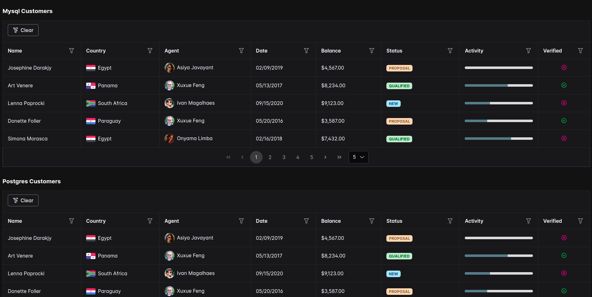
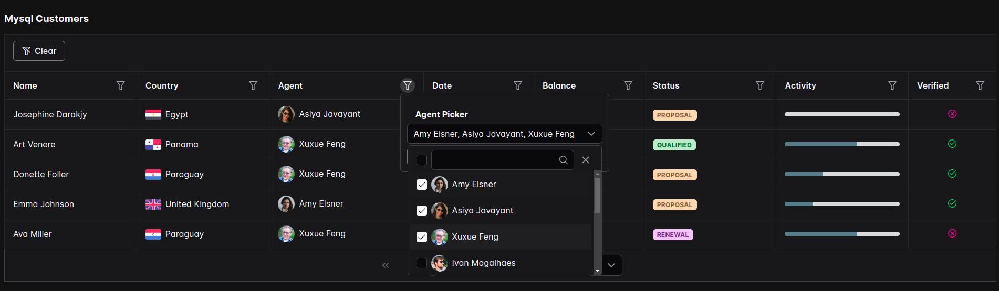
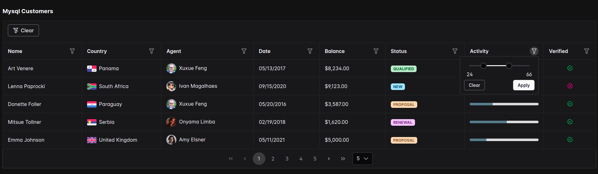
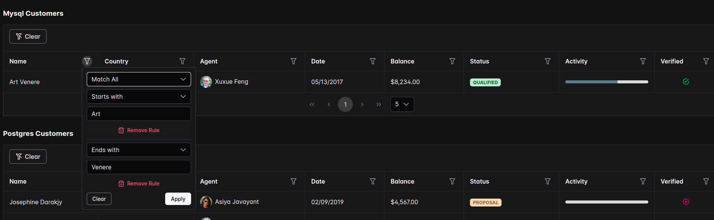

# `goprime` Example

This repository provides an example of how to use the [goprime](https://github.com/AdamShannag/goprime) Go library in a full-stack application. The example includes a Go backend that connects to PostgreSQL and MySQL databases and an Angular frontend with a datatable featuring filters.

## Project Structure

- **backend/**: Contains the Go backend server.
    - **cmd/web/**: The entry point for the Go server.
    - **docker-compose.yml**: Docker Compose configuration to initialize PostgreSQL and MySQL databases.
- **frontend/**: Contains the Angular frontend application.

## Backend

### Prerequisites

- Docker and Docker Compose
- Go (for running the Go server directly)

### Setup and Running

1. **Initialize Databases**

   Navigate to the `backend/` directory and use Docker Compose to start PostgreSQL and MySQL databases:

   ```bash
   cd backend
   docker-compose up -d
   ```

2. **Run the Go Server**

   In the `backend/` directory, start the Go server:

   ```bash
   go run ./cmd/web
   ```

   The server will be available at `http://localhost:8080` by default.

## Frontend

### Prerequisites

- Node.js and npm (or yarn)

### Setup and Running

1. **Install Dependencies**

   Navigate to the `frontend/` directory and install the required dependencies:

   ```bash
   cd frontend
   npm install
   ```

2. **Run the Angular Application**

   Start the Angular development server:

   ```bash
   ng serve
   ```

   The frontend will be available at `http://localhost:4200` by default.

### DataTable with Filters

The Angular frontend features a datatable component using PrimeNG with filtering capabilities. This allows users to view and interact with data from the Go server in a user-friendly manner.

## Images


---

---

---


